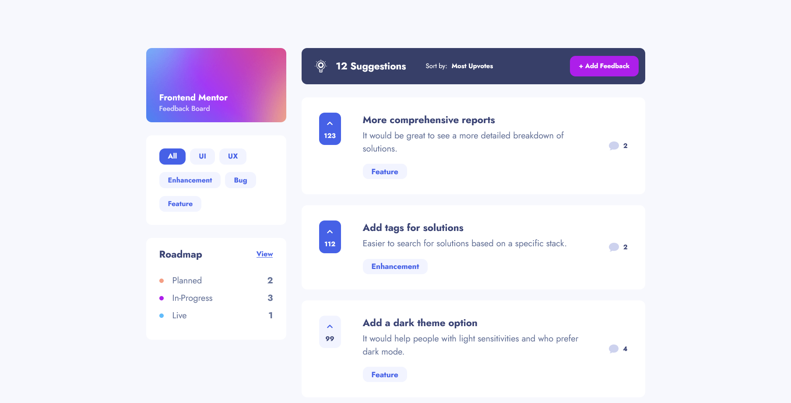

# Frontend Mentor - Product feedback app solution

This is a solution to the [Product feedback app challenge on Frontend Mentor](https://www.frontendmentor.io/challenges/product-feedback-app-wbvUYqjR6). Frontend Mentor challenges help you improve your coding skills by building realistic projects.

## Table of contents

- [Overview](#overview)
  - [The challenge](#the-challenge)
  - [Screenshot](#screenshot)
  - [Links](#links)
- [My process](#my-process)
  - [Built with](#built-with)
  - [What I learned](#what-i-learned)
  - [Continued development](#continued-development)
  - [Useful resources](#useful-resources)
- [Author](#author)

## Overview

### The challenge

Users should be able to:

- View the optimal layout for the app depending on their device's screen size
- See hover states for all interactive elements on the page
- Create, read, update, and delete product feedback requests
- Receive form validations when trying to create/edit feedback requests
- Sort suggestions by most/least upvotes and most/least comments
- Filter suggestions by category
- Add comments and replies to a product feedback request
- Upvote product feedback requests
- **Bonus**: Keep track of any changes, even after refreshing the browser (`localStorage` could be used for this if you're not building out a full-stack app)

If you view the live demo of the app at the moment, you will be "logged in" as a particular user, and you can use the app as this user. The state does not persist after refreshing right now. I am planning to build on this solution and add JSON Server or another way to save data and practise async operations with Redux.

### Screenshot



### Links

- [Solution URL:](https://www.frontendmentor.io/solutions/built-with-react-redux-styled-components-BTLCOoyyl)
- [Live Site URL:](https://product-feedback-app-wheat.vercel.app/)

## My process

### Built with

- Mobile-first workflow
- [React](https://reactjs.org/)
- [Redux Toolkit](https://redux-toolkit.js.org/)
- [Styled Components](https://styled-components.com/docs/basics) 

### What I learned

- I learnt how to use Redux Toolkit in a more complex project.

- I learnt a bit more about how to structure data store to make sure that all information is accessible (basically, how to make my own life easier for myself). For example, initially all comments were stored in an array inside the suggestion objects, and the two-level nesting made retrieving the information about comments and replies to comments really tricky. I figure that since in an SQL database, I would have a separate table for all comments, I should do the same for the Redux store. This made retrieving data from the store and saving new data in the store a lot simpler.

- I learnt how to change the wrapper component based on a condition - In this project, suggestion cards in the main view and details view change layout on wider viewports - but the layout in road map view should always stay the same. I created a conditional wrapper to avoid creating to separate components for one element:

```js
const ConditionalWrapper = ({
        condition, 
        wrapIfTrue, 
        wrapIfFalse, 
        children
    }) => condition ? wrapIfTrue(children) : wrapIfFalse(children);

const SuggestionExcerpt = ({ suggestion, showStatus, status }) => {
  // omitted code
  return (
    <ConditionalWrapper
      condition={showStatus}
      wrapIfTrue={children => <StatusCard status={status}>{children}</StatusCard>}
      wrapIfFalse={children => <ResizeableSuggestionCard>{children}</ResizeableSuggestionCard>}
    >        
    </ConditionalWrapper>
  )
}
```

- I learnt how to use functions within styled components so I can pass values other than `true` or `false` in props

```js
const setStatusColor = ({status}) => {
    if (status === 'planned') return '#f49f85'
    else if (status === 'in-progress') return '#ad1fea'
    else if (status === 'live') return '#62bcfa'
}

export const StatusCard = styled(SuggestionCard)`
  &::after {
    background-color: ${setStatusColor};
  }
}
```

### Continued development

One thing I feel like I still need to work on is accessibility with React. I know I can manage aria properties quite easily using component-level state, but I feel like there are some things that I could improve on. For example, the "Go Back" link which appears on seveal pages is a button, when it should be an anchor tag - but that's the only way I could come up with at the moment to truly return to the previous page and not to a set address.

```js
const GoBack = ({ darkText}) => {
    const history = useHistory();

    const goBackClickHandler = () => {
        history.goBack();
    }

    return (
        <GoBackLink darktext={darkText ? 1: 0} onClick={goBackClickHandler}>
            Go Back
        </GoBackLink>
    )
}
```

After this project, I feel like I've got quite a solid grasp on Redux Toolkit. As I stated above though, I will create another version of this challenge, to add in async operations and middleware.

I'd also like to learn a bit more about file structure in a bigger project like this - mine was influenced by both the Redux tutorial and a udemy course I've done on React, and I feel like the result is far from optimal.

### Useful resources

- [Redux Essentials tutorial](https://redux.js.org/tutorials/essentials/part-1-overview-concepts) - This helped me really understand how to work with Redux in a modern way. A really great tutorial!

## Author

- Frontend Mentor - [@AgataLiberska](https://www.frontendmentor.io/profile/AgataLiberska)
- Twitter - [@AgataLiberska](https://twitter.com/AgataLiberska)
